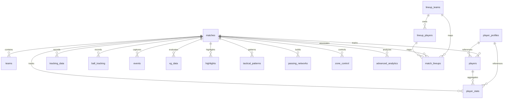

# TactiVision Pro - Database Schema Specification

This document provides a comprehensive overview of the **TactiVision Pro** relational SQLite database schema. It describes the physical data model, field specifications, indexes, foreign keys, and the dynamic roster system engineered to support advanced football analytics.

---

## 📊 Entity Relationship Diagram (ERD)

The following diagram illustrates the core tracking, advanced event analytics, and dynamic roster entities within the database:

---

## 🗃️ Tables Specification

### 1. `matches` (Match Metadata)
Stores matches processed by the video processing engine.
*   **Columns**:
    *   `match_id` (INTEGER, Primary Key, Auto-increment): Unique identifier for each match.
    *   `video_path` (TEXT, Not Null): Path to the source MP4 tactical stream.
    *   `team_a` (TEXT, Not Null): Name of team A (Home).
    *   `team_b` (TEXT, Not Null): Name of team B (Away).
    *   `match_date` (DATETIME, Default: CURRENT_TIMESTAMP): Date of match.
    *   `duration_seconds` (REAL, Default: 0): Complete match duration.
    *   `score_a` / `score_b` (INTEGER, Default: 0): Final scores.
    *   `venue` (TEXT): Venue/stadium.
    *   `fps` (REAL, Default: 25.0): Ingestion frame rate.
    *   `width` / `height` (INTEGER, Default: 1280x720): Raw resolution dimensions.
    *   `processed` (BOOLEAN, Default: 0): Ingestion completed flag.
    *   `home_team_id` / `away_team_id` (INTEGER, Nullable): Foreign keys referencing `lineup_teams(id)`.

### 2. `lineup_teams` (Dynamic Teams Catalog)
*Part of the dynamic roster layer.* Stores teams globally or independently of matches.
*   **Columns**:
    *   `id` (INTEGER, Primary Key, Auto-increment): Master team identifier.
    *   `name` (TEXT, Not Null, Unique): Team name (e.g. `Liverpool`).
    *   `short_code` (TEXT): Abbreviated name (e.g. `LIV`).
    *   `primary_color` (TEXT): hex code representation.
    *   `secondary_color` (TEXT): hex code representation.
*   **Indexes**:
    *   `ux_lineup_teams_name` (UNIQUE) on `name`.

### 3. `lineup_players` (Dynamic Roster Squads)
*Part of the dynamic roster layer.* Catalog of players associated with their master team profiles.
*   **Columns**:
    *   `id` (INTEGER, Primary Key, Auto-increment): Master player identifier.
    *   `team_id` (INTEGER, Not Null): References `lineup_teams(id)`.
    *   `name` (TEXT, Not Null): Full player name.
    *   `jersey_number` (INTEGER): Squad number.
    *   `position` (TEXT): Standard position (e.g. `FW`, `MF`, `DF`, `GK`).
    *   `dob` (TEXT): Date of birth.
    *   `height_cm` / `weight_kg` (INTEGER): Physical attributes.
    *   `active` (INTEGER, Default: 1): Active/inactive roster flag.
*   **Indexes**:
    *   `ux_lineup_players_team_jersey` (UNIQUE) on `(team_id, jersey_number)`.
    *   `idx_lineup_players_team_id` on `team_id`.

### 4. `match_lineups` (Active Squad Assignments)
*Part of the dynamic roster layer.* Links active roster players to standard or starting lineups in a specific match.
*   **Columns**:
    *   `match_id` (INTEGER, Not Null): References `matches(match_id)`.
    *   `player_id` (INTEGER, Not Null): References `lineup_players(id)`.
    *   `position_in_lineup` (TEXT): Custom tactical role/position.
    *   `is_starter` (INTEGER, Default: 0): Starting XI flag.
*   **Keys**:
    *   Primary Key: `(match_id, player_id)`.
*   **Indexes**:
    *   `idx_match_lineups_match_id` on `match_id`.
    *   `idx_match_lineups_player_id` on `player_id`.

### 5. `tracking_data` (Frame-by-Frame Positions)
High-frequency physical player positions.
*   **Columns**:
    *   `tracking_id` (INTEGER, Primary Key, Auto-increment)
    *   `match_id` (INTEGER, Not Null): References `matches(match_id)`.
    *   `player_instance_id` (INTEGER): References `players(player_instance_id)`.
    *   `frame_number` (INTEGER, Not Null)
    *   `timestamp` (REAL, Not Null): Frame timestamp in seconds.
    *   `x_norm` / `y_norm` (REAL): Normalized pitch coordinates (scale `0.0` to `1.0`).
    *   `speed_mps` (REAL): Calculated frame velocity in meters/second.
    *   `has_possession` (BOOLEAN, Default: 0)
    *   `team_in_possession` (TEXT)
*   **Indexes**:
    *   `idx_tracking_match` on `match_id`.
    *   `idx_tracking_frame` on `frame_number`.
    *   `idx_tracking_player` on `player_instance_id`.

### 6. `ball_tracking` (High-Velocity Ball Paths)
Frame-by-frame ball velocity, positions, and detection methods.
*   **Columns**:
    *   `ball_id` (INTEGER, Primary Key, Auto-increment)
    *   `match_id` (INTEGER, Not Null): References `matches(match_id)`.
    *   `frame_number` (INTEGER, Not Null)
    *   `timestamp` (REAL, Not Null)
    *   `x_norm` / `y_norm` (REAL): Normalized pitch coordinates.
    *   `velocity_magnitude` (REAL): Instantaneous ball speed.
    *   `detection_method` (TEXT): `yolo`, `color`, or `predicted`.
    *   `possessing_player_id` (INTEGER): References `players(player_instance_id)`.
*   **Indexes**:
    *   `idx_ball_tracking_match` on `match_id`.
    *   `idx_ball_tracking_frame` on `frame_number`.

### 7. `events` (Match Event Timeline)
Captures game actions like `pass`, `shot`, `goal`, `tackle`, etc.
*   **Columns**:
    *   `event_id` (INTEGER, Primary Key)
    *   `match_id` (INTEGER, Not Null)
    *   `event_type` (TEXT, Not Null): e.g., `'pass'`, `'shot'`, `'goal'`.
    *   `timestamp` (REAL, Not Null): Seconds from kickoff.
    *   `x` / `y` (REAL): Normalized event location coordinates.
    *   `metadata` (TEXT): Extensible JSON metadata block containing specific metrics.
*   **Indexes**:
    *   `idx_events_match` on `match_id`.
    *   `idx_events_type` on `event_type`.
    *   `idx_events_timestamp` on `timestamp`.

### 8. `xg_data` (AI Expected Goals Model)
Calculated shot-moment danger metrics.
*   **Columns**:
    *   `xg_id` (INTEGER, Primary Key)
    *   `match_id` (INTEGER, Not Null): References `matches(match_id)`.
    *   `xg_value` (REAL, Not Null): Probability score (`0.0` to `1.0`).
    *   `distance_to_goal` / `angle_to_goal` (REAL)
    *   `outcome` (TEXT): `'goal'`, `'saved'`, `'blocked'`, etc.
    *   `metadata` (TEXT): Safe recursively-serializable JSON object.

---

## ⚙️ Performance & Optimization Tweaks

1.  **Strict Foreign Key Constraints**: All operations execute with `PRAGMA foreign_keys = ON` to safeguard relational mapping consistency.
2.  **Normalized Coordinates**: Spatial coordinates are normalized between `0.0` and `1.0` to handle downstream dashboard visual scales regardless of the source media dimensions.
3.  **Extensible Metadata Blobs**: Columns containing `metadata` are designed as standard JSON text columns, written using custom Python recursive adapters to cleanly handle NumPy `float32`/`int64` datatypes.
