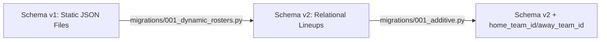

# TactiVision Pro - Database Migration Guide

This guide details the database migration roadmap implemented to upgrade **TactiVision Pro** from static file-based JSON roster squad structures to a normalized, dynamic SQL relational model.

---

## 🗺️ Migration Roadmap & Schema Versioning

Our database schema transitions from **Version 1 (Static)** to **Version 2 (Relational Roster System)**.



### 1. The Legacy System (Schema v1)
*   **Architecture**: Teams and rosters were loaded directly from static configurations located inside `rosters/*.json`.
*   **Limitations**: Bypassed relational index capabilities, prevented on-the-fly roster updates, and made cross-match player performance aggregation extremely difficult.

### 2. The Modern System (Schema v2)
*   **Architecture**: Standardized relational tables (`lineup_teams`, `lineup_players`, `match_lineups`) with strict foreign keys and index constraints.
*   **Improvements**: Automatic OCR jersey number lookups, instant player list edits via dashboard form fields, and fast relational aggregation across multi-match histories.

---

## 🛠️ Executing the Migrations

Migrations are automated, idempotent (safe to run multiple times), and designed with transaction safety.

### Command Execution
To run all database migrations and bring your database schema up to date, execute the following script:

```bash
.venv\Scripts\python scripts/seed_dynamic_rosters.py
```

This script:
1.  Loads the database file (`matches.db`).
2.  Applies `migrations/001_dynamic_rosters.py` to create the `lineup_teams`, `lineup_players`, and `match_lineups` structures.
3.  Injects default teams (e.g. `Liverpool`, `Bournemouth`, `Arsenal`, `Manchester City`) into the database schema.
4.  Maps players to their respective rosters with their custom jersey numbers and positions.

---

## 🛡️ Migration Code Breakdown

### 1. Transaction-Protected DDL
The schema migration defines table creation with `IF NOT EXISTS` guards and wraps the execution in a single transactional block:

```python
# migrations/001_dynamic_rosters.py
import sqlite3

def migrate(conn: sqlite3.Connection) -> None:
    cur = conn.cursor()
    # Enforce SQLite foreign keys during migration
    cur.execute("PRAGMA foreign_keys = ON")
    
    # 1. Create lineup_teams
    cur.execute("""
        CREATE TABLE IF NOT EXISTS "lineup_teams" (
            id INTEGER PRIMARY KEY AUTOINCREMENT,
            name TEXT NOT NULL UNIQUE,
            short_code TEXT,
            primary_color TEXT,
            secondary_color TEXT
        )
    """)
    
    # 2. Create lineup_players
    cur.execute("""
        CREATE TABLE IF NOT EXISTS "lineup_players" (
            id INTEGER PRIMARY KEY AUTOINCREMENT,
            team_id INTEGER NOT NULL REFERENCES "lineup_teams"(id),
            name TEXT NOT NULL,
            jersey_number INTEGER,
            position TEXT,
            dob TEXT,
            height_cm INTEGER,
            weight_kg INTEGER,
            active INTEGER NOT NULL DEFAULT 1,
            UNIQUE(team_id, jersey_number)
        )
    """)
    
    # 3. Create match_lineups
    cur.execute("""
        CREATE TABLE IF NOT EXISTS "match_lineups" (
            match_id INTEGER NOT NULL REFERENCES matches(match_id) ON DELETE CASCADE,
            player_id INTEGER NOT NULL REFERENCES "lineup_players"(id) ON DELETE CASCADE,
            position_in_lineup TEXT,
            is_starter INTEGER NOT NULL DEFAULT 0,
            PRIMARY KEY (match_id, player_id)
        )
    """)
```

### 2. Additive Column Migrations (`001_additive.py`)
To prevent data loss and support incremental upgrades, matches are dynamically expanded to include references to teams without breaking legacy tables:

```python
# migrations/001_additive.py
def migrate(conn: sqlite3.Connection) -> None:
    cur = conn.cursor()
    # Safely probe table columns
    cur.execute('PRAGMA table_info("matches")')
    cols = {row[1] for row in cur.fetchall()}
    
    if "home_team_id" not in cols:
        cur.execute('ALTER TABLE matches ADD COLUMN home_team_id INTEGER REFERENCES "lineup_teams"(id)')
    if "away_team_id" not in cols:
        cur.execute('ALTER TABLE matches ADD COLUMN away_team_id INTEGER REFERENCES "lineup_teams"(id)')
```

---

## 🧪 Validating the Migration State

We have established automated unit tests specifically designed to verify migration compliance:

1.  **Roster Migration Integrity**: `tests/test_roster_migration.py`
    *   Verifies that tables can be successfully initialized on top of a clean or legacy database.
    *   Asserts unique index constraints (`ux_lineup_players_team_jersey`) work exactly as intended.
2.  **Additive Column Verifications**: `tests/test_database_schema.py`
    *   Verifies that `home_team_id` and `away_team_id` are cleanly created without modifying existing matches data.

To execute all database schema validation tests, run:
```bash
.venv\Scripts\pytest tests/test_database_schema.py tests/test_roster_migration.py
```
If both tests return **green**, the database migration is completely verified and production-ready!
