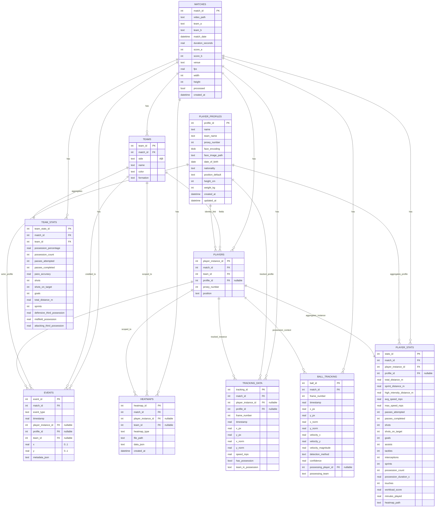
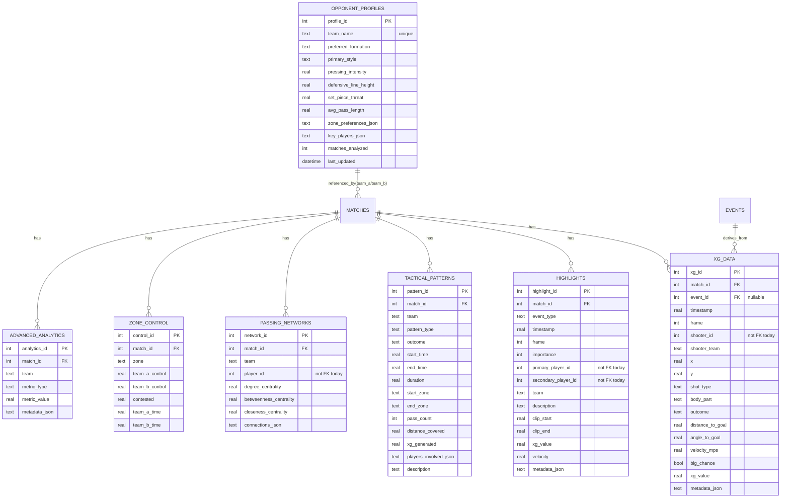

# Database schema (v2)

This document captures the **canonical SQLite schema** used by the app (see `services/database_schema.py` → `SCHEMA_SQL`).

## Core entities (match, teams, players, tracking, stats)

## Analytics add-ons (xG, highlights, tactical, scouting)

## Key modeling notes (current behavior)

- **Per-match vs cross-match identity**: `players` are per-match instances; `player_profiles` is cross-match identity. A `players.profile_id` link is optional.
- **“Team” is per match**: `teams` is scoped by `match_id`; do not treat it as a club master table.
- **Loose player references in some tables**: `xg_data.shooter_id`, `highlights.primary_player_id`, `passing_networks.player_id` are **not foreign keys** today (they typically reference the tracker’s internal player ids). If we want strong relational integrity, these should migrate to `player_instance_id` and/or `profile_id`.

